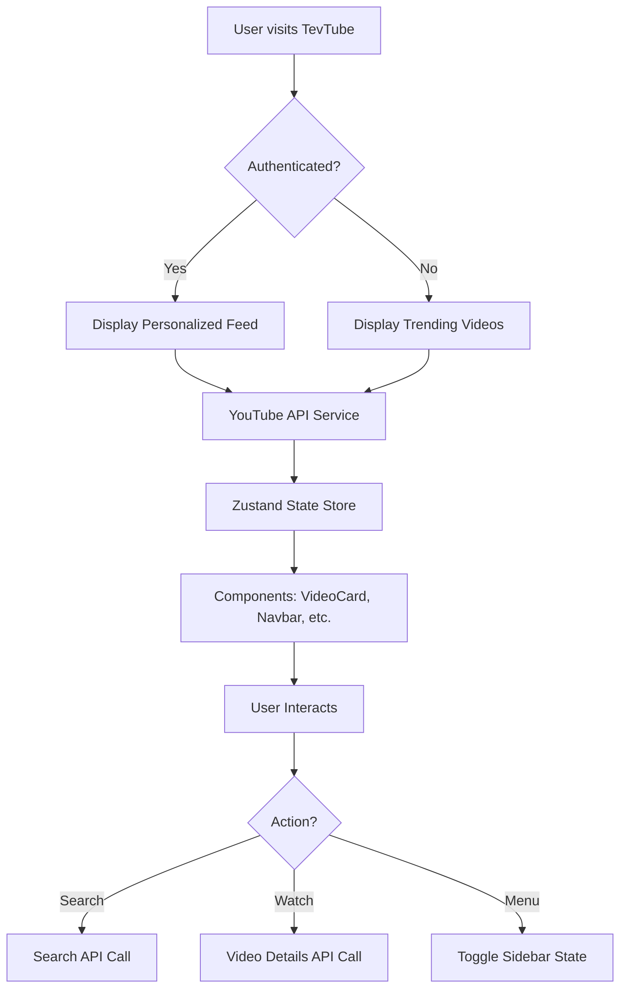
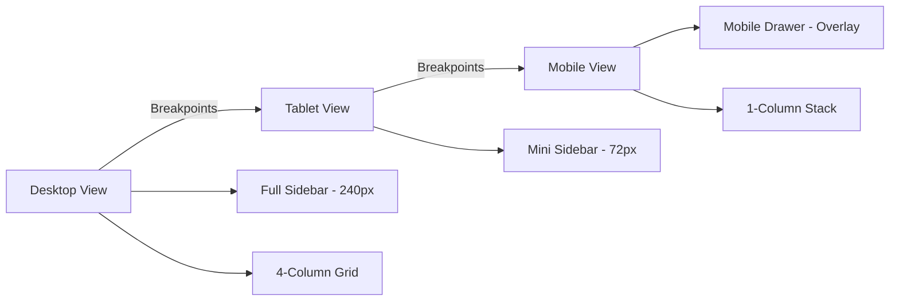

# TevTube - High-Fidelity YouTube Clone

<p align="center">
  
</p>

<p align="center">
  
</p>

## Aim
The target of TevTube is to provide a premium, lighting-fast, and fully responsive YouTube experience that mirrors the 2026 YouTube UI. It aims to showcase how modern web technologies like React, Tailwind CSS, and Clerk can be harmonized to build a high-fidelity platform capable of handling real-time data from the YouTube API.

<p align="center">
  
</p>

## The Problem
Standard video platforms and clones often suffer from:
*   Poor Mobile Responsiveness: Layouts break or become unusable on smaller screens.
*   Inconsistent UI: Lack of attention to detail regarding spacing, typography, and interactive states.
*   Complex Authentication: Implementation of secure, seamless user management is often an afterthought.
*   Data Latency: Large volumes of video data can lead to slow, unoptimized loading states.

<p align="center">
  
</p>

## The Solution
TevTube addresses these challenges through:
*   Mobile-First Responsive Design: Every component, from the sidebar to the video player, is meticulously crafted to adapt to any screen size without horizontal scrolling.
*   High-Fidelity UI/UX: Utilizing Shadcn/UI and Framer Motion to deliver smooth animations, premium typography (Outfit), and a pixel-perfect dark/light mode experience.
*   Integrated Clerk Authentication: Secure, enterprise-grade authentication with a custom-styled logout flow integrated directly into the sidebar.
*   Optimized Loading States: Customized Skeleton Loaders for every page (Home, Watch, Search) to eliminate layout shifts and provide instant visual feedback.

<p align="center">
  
</p>

## Tech Stack
| Category | Technology |
| :--- | :--- |
| Frontend Framework | [React 19](https://reactjs.org/) & [Vite](https://vitejs.dev/) |
| Styling | [Tailwind CSS](https://tailwindcss.com/) & [Shadcn/UI](https://ui.shadcn.com/) |
| Authentication | [Clerk](https://clerk.com/) |
| State Management | [Zustand](https://docs.pmnd.rs/zustand) |
| Animations | [Framer Motion](https://www.framer.com/motion/) |
| Icons | [Lucide React](https://lucide.dev/) |
| Data Fetching | [YouTube Data API v3](https://developers.google.com/youtube/v3) |

<p align="center">
  
</p>

## System Architecture & Flow

### Data & State Flow


### Responsive Layout Flow


<p align="center">
  
</p>

## Features Available
*   Home Page: Dynamic trending feed with category filters.
*   Search: Real-time video search with detailed result cards.
*   Watch Page: Premium video player with related videos, comments, and responsive reordering.
*   Shorts: Mobile-optimized vertical scrolling shorts feed.
*   Notifications: Integrated UI for user alerts.
*   Dark Mode: Complete system-themed or manual dark/light toggle.
*   User Management: Custom profile page and history dashboard.
*   Live Stream Support: High-fidelity badges for live content.

<p align="center">
  
</p>

## How to Run

1. Clone the repo
   ```bash
   git clone https://github.com/JonniTech/YouTube-Clone.git
   ```
2. Install dependencies
   ```bash
   yarn install
   ```
3. Setup Environment Variables
   Create a .env file and add your keys:
   ```env
   VITE_CLERK_PUBLISHABLE_KEY=your_key
   VITE_YOUTUBE_API_KEY=your_key
   ```
4. Start Development Server
   ```bash
   yarn dev
   ```

<p align="center">
  
</p>

## Design Principles
*   Clarity: High contrast and clear typography.
*   Feedback: Immediate visual cues for every interaction (skeletons, hover effects).
*   Premium Feel: Subtle gradients, rounded corners, and generous whitespace.

<p align="center">
  
</p>

Programmed by NYAGANYA
